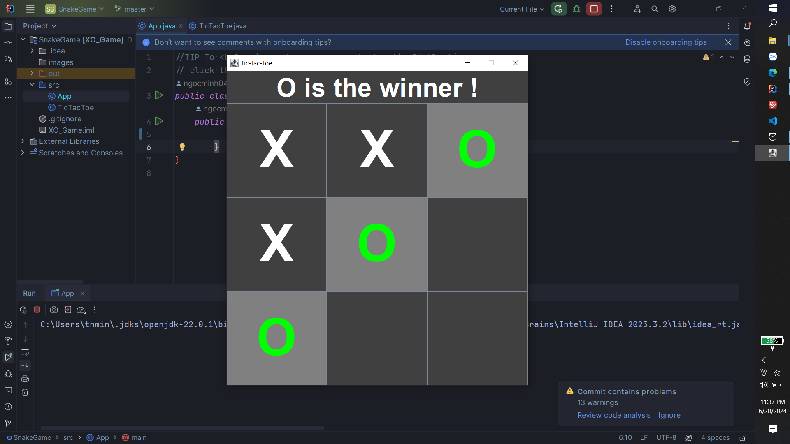

# Trò Chơi Tic-Tac-Toe

Đây là một trò chơi Tic-Tac-Toe(XO Game) đơn giản được viết bằng Java sử dụng thư viện Swing để tạo giao diện người dùng (GUI).

## Tính Năng

- Trò chơi hai người (Người chơi X và Người chơi O)
- Bàn chơi đồ họa với các nút bấm
- Hiển thị thông báo lượt chơi của người chơi hiện tại
- Kiểm tra và hiển thị người chiến thắng hoặc thông báo hòa khi bàn chơi đầy

## Cách Chơi

1. Mở trò chơi bằng cách chạy chương trình Java.
2. Người chơi X bắt đầu trước.
3. Nhấp vào các ô trống trên bàn cờ để đánh dấu lượt của bạn.
4. Trò chơi sẽ tự động kiểm tra người chiến thắng sau mỗi lượt đi.
5. Khi có người chiến thắng hoặc khi bàn cờ đầy, trò chơi sẽ hiển thị thông báo kết quả.

## Hướng Dẫn Cài Đặt

1. Tải mã nguồn về từ GitHub.
2. Mở dự án trong môi trường phát triển Java (ví dụ: IntelliJ IDEA, Eclipse).
3. Chạy tệp `TicTacToe.java` để bắt đầu trò chơi.

## Ghi Chú

Trò chơi này được clone app từ video YouTube chỉ nhằm mục đích thực hành Java và OOP: [Code Tic Tac Toe in Java](https://www.youtube.com/watch?v=Nc77ymnm8Ss&list=PLnKe36F30Y4Y1XQOqNsL9Fgg_p6nYhcng&index=6).

